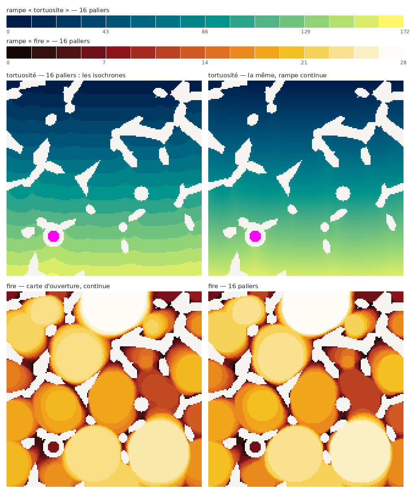

# Les rampes de couleur

Une carte scalaire lue en couleur est une mesure lue par l'œil : la rampe fait
partie de la méthode, pas de la décoration. Deux règles suffisent à s'en sortir,
et elles sont vérifiées par des tests.

**La clarté varie dans un seul sens.** C'est la seule propriété qui compte. Une
rampe dont la clarté remonte — l'arc-en-ciel, `jet` — fabrique des frontières là
où les données sont lisses, et en efface là où elles ne le sont pas. Les cinq
rampes à teinte unique (`blue`, `orange`, `teal`, `violet`, `grey`) vont du clair
au foncé ; les deux rampes perceptuelles ci-dessous tournent en teinte, mais leur
`L*` CIELAB croît strictement, ce qui les rend lisibles.

**Ce qui n'est pas une valeur ne prend pas une couleur de la rampe.**



## `tortuosite` — 16 paliers

Construite en LCh : `L*` de 11 à 96 par pas réguliers, teinte de 282° (bleu nuit)
à 100° (jaune). Mesures sur les seize paliers :

| | valeur |
|---|---:|
| pas minimal de `L*` | 5,2 |
| ΔE00 entre paliers voisins | ≥ 4,9 (médiane 7,0) |
| ΔE00 en deutéranopie | ≥ 3,7 |
| ΔE00 en protanopie | ≥ 3,2 |

Seize est à peu près le maximum : au-delà, `L*` avance de moins de 5 par palier
et les bandes cessent d'être distinguables. Si la figure doit rester lisible en
vision déficiente hors contexte, descendre à douze.

Elle est faite pour les champs qu'on lit par leurs **iso-valeurs**, la carte de
temps de parcours en premier lieu. En escalier, chaque bande est une isochrone :
ce qu'on voit alors, c'est le front qui prend du retard derrière chaque brin —
et cet écart à un front plan **est** la tortuosité. En rampe continue, la même
carte ne montre plus qu'un dégradé.

La quantification est honnête ici parce que les frontières tombent à des valeurs
annoncées : `vmin + k (vmax - vmin) / 16`. Ce n'est pas un artefact de rampe,
c'est une carte d'iso-valeurs.

## `fire` — thermique

`L*` de 3 à 99, teinte de 25° à 100°, chroma maximale au milieu et nulle aux deux
bouts — la séquence du corps noir. ΔE00 entre paliers voisins ≥ 6,1 (≥ 4,5 en
deutéranopie, ≥ 3,9 en protanopie), plus confortable que `tortuosite` parce que
la teinte parcourt moins de chemin pour la même plage de clarté.

Pour les champs à grande dynamique dont on lit surtout les extrêmes : carte
d'ouverture, carte de distance, temps de parcours. Attention à son bas, presque
noir : sur fond sombre, les petites valeurs disparaissent.

## Le magenta n'est pas une valeur

`#ff00ff` marque les voxels **hors domaine**. Il est à plus de 19 unités de ΔE00
de tous les paliers des deux rampes, en vision normale comme en deutéranopie et
en protanopie : il ne peut pas passer pour une mesure. Il est laid exprès.

Encore faut-il savoir ce qu'il marque. Sur une carte de temps de parcours, deux
choses ne sont pas finies, et elles ne disent pas la même chose :

- `nan` : hors du masque. C'est le solide — pas du domaine du tout. **Transparent**,
  le fond transparaît.
- `inf` : dans le masque, jamais atteint par le front. Cul-de-sac, porosité
  fermée. **Magenta**.

Confondre les deux rendrait invisible exactement ce qu'on cherche : sur la figure
ci-dessus, la cellule fermée en magenta serait indiscernable d'un brin.
`np.isfinite` continue de répondre « atteint », donc les mesures ne changent pas.

## Dans l'interface

Le panneau d'un calque continu porte les deux réglages : **paliers** (`0` = rampe
continue) et **hors-domaine**. Un calque dont le nom finit par `_temps` s'ouvre
directement en `tortuosite`, 16 paliers, hors-domaine visible.

```python
from morphanalyzer.webapp.render import LayerView, NODATA_COLOR, colormap, render_slice

lut = colormap("tortuosite", bands=16)      # (256, 3), seize couleurs constantes
vue = LayerView(temps, kind="scalar", ramp="tortuosite", bands=16,
                nodata_color=NODATA_COLOR, vmin=0, vmax=tau_max)
png = render_slice([vue], axis=2, index=64)
```

La figure de cette page se refabrique avec `python tools/build_ramp_figure.py`.
