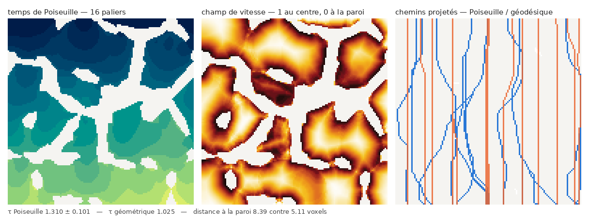

# Tortuosité

## Ce que mesure une tortuosité

La tortuosité de Carman compare la longueur du plus court chemin dans la phase à
la distance à vol d'oiseau :

$$\tau = \left(\frac{L_{\min}}{\lVert p_1 - p_2 \rVert}\right)^2$$

C'est bien un **carré** — l'usage en milieux poreux, hérité de la loi de
Kozeny–Carman, où $\tau$ intervient au carré dans la perméabilité. Un milieu
libre vaut exactement 1.

La longueur géodésique est obtenue par fast marching : on résout l'équation
eikonale $\lVert \nabla T \rVert = 1/F$ depuis la source, et $T$ est le temps de
parcours minimal.

!!! note "Convention de vitesse"
    iMorph résout $\lVert \nabla T \rVert = F$ : son « champ de vitesse » est en
    réalité une **lenteur**. Le module expose les deux : `speed=` suit la
    convention standard, `cost=` celle d'iMorph.

## Point à point

```python
import morphanalyzer as ma

vol = ma.phantoms.voronoi_foam((128,)*3, n_cells=24, strut=3.0, seed=0)
res = ma.tortuosity.point_tortuosity(vol.fluid, source=(10, 64, 64))

res.value        # tortuosité moyenne sur les points atteints
res.tau          # idem (alias)
res.travel_time  # carte des temps de parcours
res.n_reached    # nombre de voxels atteints
```

## Le piège du premier ordre

Le schéma amont du premier ordre sous-estime les trajets obliques : sur une
diagonale 2D il donne +2,7 %, en 3D +3,8 %. Comme la tortuosité élève ce rapport
au carré, le biais devient +8,8 % — assez pour qu'un milieu libre ressorte à
1,088 au lieu de 1.

D'où le paramètre `reference` :

```python
ma.tortuosity.point_tortuosity(mask, source=..., reference="free_front")
```

`"free_front"` divise le temps de parcours par celui du **même solveur** dans une
boîte vide de même géométrie. Le biais numérique se simplifie et un milieu libre
redonne exactement 1,0000. `"euclidean"` divise par la distance euclidienne,
c'est-à-dire la définition brute, biais compris.

## De face à face, et par direction

```python
ma.tortuosity.plane_tortuosity(mask, face=0)          # z=0 vers z=zmax
ma.tortuosity.directional_tortuosity(mask, angles=16) # rosace dans un pavé inscrit
```

`directional_tortuosity` travaille dans le plus grand pavé inscrit, pour que la
direction mesurée ne soit pas contaminée par la forme de la boîte.

## Tortuosité hydraulique

Un champ de vitesse de Poiseuille pousse le chemin vers l'axe du conduit :

$$F(x) = 1 - \left(1 - \frac{d(x)}{R(x)}\right)^2$$

où $d$ est la distance à la paroi et $R$ l'ouverture locale.



```python
res = ma.tortuosity.poiseuille_tortuosity(fluide, face=0, n_paths=16)

res.tortuosity                # 1,310 — les chemins choisis par le champ
res.geometric_tortuosity      # 1,025 — mêmes extrémités, métrique géodésique
res.mean_wall_distance_poiseuille   # 8,39 voxels
res.mean_wall_distance_geometric    # 5,11 voxels

res.paths                     # une ligne par chemin et par métrique
res.speed, res.travel_time    # les deux champs
res.path_mask                 # les chemins, une étiquette chacun
res["tortuosity"]             # l'objet reste un Mapping : dict(res) marche
```

Les deux métriques sont comparées **sur les mêmes extrémités**, faute de quoi la
comparaison ne veut rien dire.

!!! warning "`geometric_tortuosity` est un témoin, pas une mesure du milieu"
    C'est la tortuosité géodésique **sur les seize extrémités retenues**, là pour
    isoler l'effet du champ de vitesse. Pour la tortuosité du milieu, c'est
    `plane_tortuosity` qu'il faut : elle moyenne sur toute la face d'arrivée.

### Le choix des extrémités

`ends="spread"` (défaut) découpe la face d'arrivée en grille et retient dans
chaque case le voxel atteint le plus tôt. `ends="fastest"` prend simplement les
`n_paths` voxels les plus rapides — et c'est un piège : ces voxels sont au bout
des canaux les plus directs, si bien que la tortuosité géodésique associée vaut
**1,000** dans à peu près n'importe quel milieu ouvert. Mesuré sur une mousse de
128³ à 64 cellules :

| `ends` | τ Poiseuille | τ géodésique | `plane_tortuosity` |
|---|---:|---:|---:|
| `"fastest"` | 1,184 ± 0,072 | 1,000 | 1,047 |
| `"spread"` | 1,310 ± 0,101 | 1,025 | 1,047 |

### Un biais corrigé : la descente de gradient

Les chemins sont extraits par descente sur la carte des temps. Le critère était
« le voisin de plus petit `T` », sans regarder la longueur du pas. Dans un canal
large le front est quasi plan : un pas diagonal (longueur $\sqrt3$) descend
autant qu'un pas axial (longueur 1), rien ne pénalise le zigzag, et la longueur
gonfle. Dans un tube droit, où la tortuosité vaut exactement 1, on mesurait
**1,17**. Le critère est maintenant la **pente**, $(T - T_{voisin})/\ell$ :

| | avant | après |
|---|---:|---:|
| tube droit, τ géodésique | 1,172 | **1,0000** |
| mousse, longueur de chemin vs `T` | +20,8 % | **+0,0 %** |

## La chaîne complète

Dans l'interface, la chaîne type **tortuosité de Poiseuille** enchaîne tout, sur
la phase fluide :

```
distance_transform      -> distance          d, la distance à la paroi
aperture_map            -> ouverture         R, le rayon local du conduit
plane_tortuosity        -> tortuosite_plan   la tortuosité du milieu, par référence
poiseuille_tortuosity   -> poiseuille        distance=@distance, aperture=@ouverture
```

La carte d'ouverture est l'étape coûteuse : la calculer une fois et la passer
évite que `poiseuille_tortuosity` la refasse pour lui seul. En ligne de commande,
la même chose :

```python
import morphanalyzer as ma

fluide = ~volume.solid
d = ma.distance.distance_transform(fluide)
R = ma.granulometry.aperture_map(fluide, n_radii=24)
res = ma.tortuosity.poiseuille_tortuosity(fluide, face=0, distance=d, aperture=R)
```

La dernière étape laisse dans le projet cinq mesures (`poiseuille`,
`_ecart_type`, `_geometrique`, `_paroi`, `_paroi_geo`), deux tables (`_resume`,
`_chemins`) et quatre calques (`_temps`, `_vitesse`, `_trajets`, `_trajets_geo`).
Le calque `_temps` s'ouvre en rampe `tortuosite` à 16 paliers : ses bandes sont
les isochrones du front de Poiseuille.

La figure de cette page se refabrique avec
`python tools/build_poiseuille_figure.py`.

!!! warning "La variante d'iMorph est refusée"
    iMorph utilisait $F = 1 - d^2/R^2$, qui s'annule au **centre** du conduit au
    lieu d'y être maximale. Le résultat dégénère de façon dépendante des données
    ($\tau = 0{,}44$ sur une mousse, 1,02 sur une autre).
    `poiseuille_speed(variant="imorph")` la donne toujours, pour inspection ;
    `poiseuille_tortuosity` la refuse par une `ValueError`.

## Sur le graphe

Quand le réseau de pores est déjà extrait, Dijkstra suffit :

```python
cells, throats = ma.segmentation.pore_network(labels)
tau = ma.tortuosity.graph_tortuosity(cells, throats, axis=0)
```
